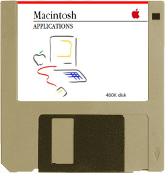

[](./assets/macintosh-applications-diskette.jpg)

# macOS Developer Resources

Resources useful in learning about development native macOS apps.

## Contributing

If you have content to add, or notice an error, please open a pull request or issue with your changes. I'd very much like for this to be a collaborative source of information.

## Table of Contents

- [Topics](#topics)
	- [Continuous Integration / Continuous Deployment](#continuous-integration-continuous-deployment)
	- [Design](#design)
	- [Code Signing](#code-signing)
	- [Hardened Runtime](#hardened-runtime)
	- [Logging](#logging)
	- [Responder Chain & Key View Loop](#responder-chain--key-view-loop)
- [Books](#books)
- [Videos](#videos)
- [Conferences](#conferences)
- [Blogroll](#blogroll)
- [Tweeters](#tweeters)
- [Other Resources](#other-resources)
- [About](#about)

---

## Topics

### Continuous Integration / Continuous Deployment

- [Xcode Server and Continuous Integration Guide: About Continuous Integration in Xcode](https://developer.apple.com/library/archive/documentation/IDEs/Conceptual/xcode_guide-continuous_integration/)
- [Xcode Server API Reference](https://developer.apple.com/library/archive/documentation/Xcode/Conceptual/XcodeServerAPIReference/index.html#//apple_ref/doc/uid/TP40016472)

---

### Design

- [macOS - Human Interface Guidelines (HIG)](https://developer.apple.com/design/human-interface-guidelines/macos/overview/themes/)
- [Apple Design Resources](https://developer.apple.com/design/resources/)
- [Human Interface Guidelines Extras](https://github.com/sindresorhus/human-interface-guidelines-extras) by [Sindre Sorhus](https://sindresorhus.com)
- [Design and implement macOS document icons](https://developer.apple.com/news/?id=5i6jlf4d)

#### Menu Bar Icons

Some tweets from [Jeff Nadeau](https://twitter.com/jnadeau) about menu bar icon sizing and design:

> You get 22pt of height (and wouldn’t want to extend into the margins except for fine details) so that seems fine.
In Big Sur a symbol image is ideal. The size, weight, and baseline are chosen to be consistent across menu extras, and it works w/ the “bigger menu text” AX pref
>
> One technique is to design within a 22pt bounding box so you can pick the exact vertical bearing of your icon within the whitespace.
(We did this for the original Touch Bar icons. We allow “full bleed” content there, so the icons were uniformly produced in a 30pt tall canvas.)
>
> — <cite>Jeff Nadeau \[[tweet 1](https://twitter.com/jnadeau/status/1346714319174606849)] \[[tweet 2](https://twitter.com/jnadeau/status/1346711906636087296)]</cite>

---

### Code Signing

Code signing is one of the most confusing and complex parts of developing for Apple platforms. Here are a few helpful guides to help make sense of the process.

- [Code Signing for macOS](https://wiki.lazarus.freepascal.org/Code_Signing_for_macOS)
- [Notarization for macOS 10.14.5+](https://wiki.lazarus.freepascal.org/Notarization_for_macOS_10.14.5%2B)
- [Apple Developer Certificates](https://wiki.lazarus.freepascal.org/Apple_Developer_Certificates) - A great reference of all the different types of certificates involved in developing for Apple platforms.

---

### Hardened Runtime

- [Hardened Runtime Entitlements](https://developer.apple.com/documentation/security/hardened_runtime_entitlements)

---

### Logging

- [Generating Log Messages from Your Code](https://developer.apple.com/documentation/os/logging/generating_log_messages_from_your_code)

#### Making Logs Show in Console.app Correctly

In order for dynamic log messages to show up in Console.app, you must use the `{public}` modifier on the value

```swift
let variableToInsert = "hello"

os_log(.debug, "message with variable: %@", variableToInsert)         // prints: "message with variable: <private>"
os_log(.debug, "message with variable: %{public}@", variableToInsert) // prints: "message with variable: hello"
```

---

### Responder Chain & Key View Loop

- [NSResponder - AppKit](https://developer.apple.com/documentation/appkit/nsresponder)
- [Event Architecture - Cocoa Event Handling Guide](https://developer.apple.com/library/archive/documentation/Cocoa/Conceptual/EventOverview/EventArchitecture/EventArchitecture.html#//apple_ref/doc/uid/10000060i-CH3-SW2)
- [Debugging the Responder Chain | mjtsai.com](https://mjtsai.com/blog/2019/07/30/debugging-the-responder-chain/)

---

## Books

- [Cocoa Programming for OS X](https://www.amazon.com/Cocoa-Programming-OS-Ranch-Guides/dp/0134076958) - Somewhat out of date, but filled with lots of essential Mac programming information, with examples in Swift
- [Hacking With macOS](https://www.hackingwithswift.com/store/hacking-with-macos) - From Paul Hudson. Up to date with SwiftUI and his books recieve lifetime updates.

---

## Videos

- [AppleProgramming](https://www.youtube.com/c/AppleProgramming) - by [Lucas Derraugh](https://derraugh.com)
- [Back to the Mac](https://www.youtube.com/channel/UCqiRMXmkXN1KDrX4WYlS5rw) - Conference videos from the [Back to the Mac](https://backtomac.org) online conference

---

## Conferences

### Back to the Mac

Back to the Mac conference where misfits, rebels, troublemakers, and the ones who think differently will share their knowledge about developing Mac apps. The conference is free. There are no registration or application fees. It is completely online as a collection of videos on our YouTube channel.

- Website: [backtomac.org](https://backtomac.org)
- GitHub: [@backtomac](https://github.com/backtomac)
- YouTube: [youtube.com/channel/UCqiRMXmkXN1KDrX4WYlS5rw](https://www.youtube.com/channel/UCqiRMXmkXN1KDrX4WYlS5rw)
- Newsletter: [tinyletter.com/backtomac](https://tinyletter.com/backtomac)

---

## Blogroll

Sites with high quality development content, that is sometimes or always focused on the Mac:

- [Bitsplitting](https://bitsplitting.org) by Daniel Jalkut
- [chris.eidhoff.nl](http://chris.eidhof.nl) by Chris Eidhof
- [Cocoa with Love](https://www.cocoawithlove.com) by Matt Gallegher
- [Hacking with Swift](https://www.hackingwithswift.com/articles) by Paul Hudson
- [inessential](https://inessential.com) by Brent Simmons
- [Lapcat Software](http://lapcatsoftware.com/articles/index.html) by Jeff Johnson
- [LostMoa](https://lostmoa.com/blog/) by Matthaus Woolard
- [mjtsai.com](https://mjtsai.com/blog/) by Michael Tsai
- [NSHipster](https://nshipster.com) by Mattt
- [oleb.net](https://oleb.net/blog/) by Ole Begemann
- [Rambo.codes](https://rambo.codes) by Gui Rambo
- [Swift by Sundell](https://www.swiftbysundell.com) by John Sundell
- [TrozWare](https://troz.net) by Sarah Reichelt
- [tyler.io](https://tyler.io) by Tyler Hall
- [User Your Loaf](https://useyourloaf.com/blog/) by Keith Harrison

## Chat Servers

Online communities that are focues on macOS app development:

- [AppKit Abusers (Slack)](https://appkit-abusers.herokuapp.com)
- [MacMakers.chat](https://macmakers.chat/invite-requests)
- [Core Intuition Slack](http://chat.coreint.org)
- [CocoaHeads Discord](https://discord.gg/Sq7PMyDRkJ)

## Tweeters

People on Twitter who (at least sometimes) tweet about macOS development:

- [@_inside](https://twitter.com/_inside)
- [@brentsimmons](https://twitter.com/brentsimmons)
- [@chriseidhof](https://twitter.com/chriseidhof)
- [@cocoawithlove](https://twitter.com/cocoawithlove)
- [@danielpunkass](https://twitter.com/danielpunkass)
- [@jnadeau](https://twitter.com/jnadeau)
- [@johnsundell](https://twitter.com/johnsundell)
- [@kharrison](https://twitter.com/kharrison)
- [@krzyzanowskim](https://twitter.com/krzyzanowskim)
- [@lapcatsoftware](https://twitter.com/lapcatsoftware)
- [@macsome](https://twitter.com/macsome)
- [@mattt](https://twitter.com/mattt)
- [@mjtsai](https://twitter.com/mjtsai)
- [@mxcl](https://twitter.com/mxcl)
- [@olebegemann](https://twitter.com/olebegemann)
- [@patrickwardle](https://twitter.com/patrickwardle)
- [@rydermackay](https://twitter.com/rydermackay)
- [@sindresorhus](https://twitter.com/sindresorhus)
- [@twostraws](https://twitter.com/twostraws)
- [@UINT_MIN](https://twitter.com/UINT_MIN)

## Other Resources

- [lists.apple.com Mailing Lists](https://lists.apple.com/mailman/listinfo) - old school mailing lists, but sometimes the only source of good information
- [Open Source Mac Apps](https://github.com/serhii-londar/open-source-mac-os-apps) - a list of open source Mac applications on GitHub for your perusal

## About

This document is maintained by me, [Isaac Halvorson](https://hisaac.net). I started this after making the jump from iOS development to macOS development, and noticing a distinct lack of good content pertaining specifically to developing for the Mac platform. After some chatter recently about this on Twitter, I figured it was high time someone started to catalog these things somewhere.
